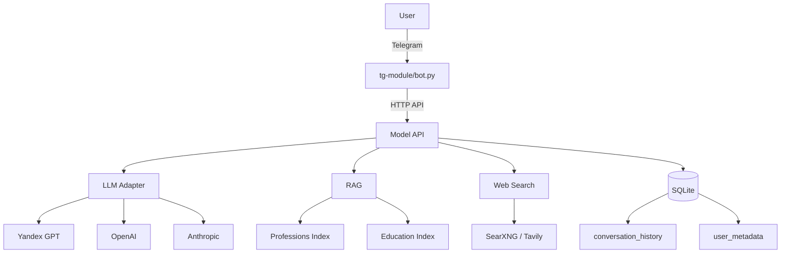

# Product Proposal: AI-компаньон для профориентации

## 1. Обоснование идеи: решаемая проблема

**Проблема:** сегодня процесс профориентации фрагментирован. Пользователю нужно самостоятельно искать разрозненные тесты, читать статьи о профессиях, собирать информацию об образовательных программах. Живой консультант доступен не всем и стоит денег.

**Решение:** AI Gigaschool — диалоговый помощник в Telegram, который:

- собирает портрет пользователя (возраст, статус, интересы, цели);
- проводит профориентационные тесты или использует их результаты;
- на основе собранных данных выдаёт персонализированные рекомендации профессий;
- предоставляет детальную информацию о профессии и образовательные roadmaps с конкретными курсами (Stepik, Поступи, Нетология, Skillfactory) через RAG-поиск.

Всё это объединено в единый диалоговый поток, доступный 24/7 без необходимости обращаться к человеку.

---

## 2. Цель проекта и метрики успеха

### Цель PoC

Создать работающий прототип, демонстрирующий ключевые сценарии: знакомство → сбор портрета → тестирование → рекомендации → обсуждение профессий и построение образовательных траекторий.

### Ключевые метрики успеха

| Категория                        | Метрика                                                                                                                 | Целевое значение (PoC)                                                                                                                                                                              | Способ измерения                                                                       |
| ----------------------------------------- | ------------------------------------------------------------------------------------------------------------------------------ | ------------------------------------------------------------------------------------------------------------------------------------------------------------------------------------------------------------------ | ----------------------------------------------------------------------------------------------------- |
| **Продуктовые**          | Завершение полного сценария (WHO → ABOUT → TEST → RECOMMENDATION → TALK)                          | Пользователь доходит до списка профессий и хотя бы один раз запрашивает описание или roadmap                                               | Логи событий в БД; анализ сессий                                            |
|                                           | Использование интерактивных элементов (кнопки профессий, RAG-запросы) | Запросы к эндпоинтам `/get_profession_info/` и `/get_profession_roadmap/` выполняются без ошибок                                                                        | Мониторинг API (количество успешных вызовов, ошибки 4xx/5xx) |
| **Качество диалога** | Корректное определение типа пользователя (school/student/worker)                          | Tool call `userType` возвращает осмысленный результат, соответствующий диалогу на этапе WHO                                                           | Анализ логов (проверка на тестовых сценариях)                   |
|                                           | Релевантность рекомендаций                                                                            | Рекомендованные профессии хотя бы косвенно связаны с собранным портретом (качественная оценка на демо)                     | Экспертная оценка на демо-сессиях                                        |
|                                           | Стабильность переходов между этапами                                                          | Нет «залипания» на одном этапе; корректная обработка команд [EXIT] и tool calls                                                                                | Тестирование потоков; логи этапов                                        |
| **Технические**          | Доступность Model API для бота                                                                               | Эндпоинты `/start_talk/`, RAG, `/clean_history/` отвечают в локальном или Docker-окружении                                                                              | Health checks; мониторинг ответов                                                    |
|                                           | Корректное сохранение и очистка контекста                                                 | После `/clean_history` история и метаданные пользователя полностью удаляются; новый диалог начинается «с чистого листа» | Ручная проверка; запросы к БД после очистки                       |
|                                           | Наличие базового мониторинга                                                                         | Метрики LLM (количество запросов, токены, длительность) доступны в Prometheus/Grafana                                                                          | Проверка дашбордов                                                                   |

---

## 3. Сценарии использования (включая edge-кейсы)

### Основные сценарии

#### Школьник

1. Пользователь запускает бота командой `/start`.
2. Бот знакомится: узнаёт имя, возраст, статус («школьник»).
3. На этапе ABOUT бот выясняет интересы (любимые предметы, хобби), примерные планы после школы.
4. Предлагает пройти тест (например, на склонность к типу деятельности). Вопросы генерируются или выбираются из базы.
5. На основе ответов и портрета бот выдаёт 3–5 рекомендуемых профессий с кратким описанием.
6. Пользователь нажимает кнопку с профессией → получает подробное описание и roadmap (необходимые навыки, курсы, вузы).

#### Студент

Аналогично, но акцент на дополнительное образование, смену специализации, совмещение с учёбой. Бот может предлагать более продвинутые курсы и программы магистратуры.

#### Работающий взрослый

Сценарий переквалификации: бот узнаёт текущую профессию, причины недовольства, желаемые направления. Тесты помогают выявить скрытые интересы. Рекомендации учитывают возможность быстрого входа в новую профессию (интенсивные курсы, стажировки).

### Edge-кейсы

| Ситуация                                                                                                        | Ожидаемое поведение                                                                                                                                                                                                                                                                                                                                                     |
| ----------------------------------------------------------------------------------------------------------------------- | ----------------------------------------------------------------------------------------------------------------------------------------------------------------------------------------------------------------------------------------------------------------------------------------------------------------------------------------------------------------------------------------- |
| **Некорректный или уклончивый ввод на этапе WHO/ABOUT**                       | Бот задаёт уточняющие вопросы, не переходит к следующему этапу, пока не получит достаточно данных. Не «додумывает» за пользователя.                                                                                                                                         |
| **Смена типа пользователя в процессе**                                              | Тип фиксируется после этапа WHO. Для изменения нужно использовать `/clean_history` и начать заново.                                                                                                                                                                                                                   |
| **Отказ от теста или досрочный выход**                                               | Тест можно пропустить (бот перейдёт к рекомендациям на основе уже собранного портрета). Если пользователь вышел, при возврате продолжит с места остановки.                                                                                               |
| **Запрос информации о профессии не из списка рекомендованных** | Кнопки формируются только для рекомендованных профессий. Если пользователь вводит название вручную, бот может обработать запрос через общий диалог (TALK) и при наличии профессии в индексе выдать информацию. |
| **Очень длинные сообщения / спам**                                                       | Telegram ограничивает длину сообщения; на стороне API установлены лимиты на контекст и обрезка истории.                                                                                                                                                                                                      |
| **Повторный вызов `/cancel` или `/clean_history`**                                           | `/cancel` сбрасывает текущую активность, но не удаляет данные. `/clean_history` идемпотентно: повторный вызов не приводит к ошибке.                                                                                                                                                            |
| **Недоступность внешних сервисов (LLM, RAG, веб-поиск)**                      | Бот возвращает понятное сообщение об ошибке и предлагает повторить попытку позже. При отсутствии RAG используется кэшированное описание профессии.                                                                                                            |

---

## 4. Ограничения и допущения PoC

### Технические ограничения

- **Задержки ответа:** время ответа зависит от LLM-провайдера (обычно 2–10 секунд) и вызовов RAG (дополнительно 1–5 секунд). В сложных сценариях может достигать 30 секунд.
- **Хранилище:** SQLite (локальный файл) – не рассчитано на высокую нагрузку; при масштабировании потребуется миграция на PostgreSQL с репликацией.
- **Векторный поиск:** FAISS в оперативной памяти; объём ограничен текущим набором профессий и образовательных программ (~несколько тысяч документов).
- **Лимиты провайдеров LLM:** квоты на количество запросов и токенов. При превышении запросы будут отклоняться; механизмов автоматического переключения между провайдерами в PoC нет.

### Операционные ограничения

- **Бюджет:** ограниченный объём запросов к платным API (LLM, возможно веб-поиск). Предполагается ежемесячный лимит на демо-сессии.
- **Поддержка и обновления:** индексы профессий и курсов обновляются вручную; промпты и конфигурация изменяются без CI/CD.
- **Безопасность и соответствие:** базовая защита описана в [governance.md](governance.md). В PoC не реализована полная анонимизация логов и соответствие 152-ФЗ; при переходе в продуктив требуется доработка.

---

## 5. Архитектурный набросок

### Модули и их взаимодействие

### Компоненты

| Компонент                                 | Назначение                                                                                                                                    | Технологии / интеграции                                                |
| -------------------------------------------------- | ------------------------------------------------------------------------------------------------------------------------------------------------------- | ------------------------------------------------------------------------------------------ |
| **Telegram Bot (tg-module)**                 | Приём сообщений, отображение кнопок, вызов Model API.                                                               | `python-telegram-bot`, HTTP-клиент                                                 |
| **Model API (model/)**                       | Оркестрация диалога: управление этапами, вызов LLM, tools, RAG, работа с репозиторием.       | FastAPI, Pydantic, asyncio                                                                 |
| **LLM Adapter**                              | Единый интерфейс для разных провайдеров (chat, tool calls).                                                          | YandexGPT, OpenAI, Anthropic, Google AI (через соответствующие SDK)    |
| **Репозиторий**                   | Хранение истории сообщений и метаданных пользователя.                                                    | SQLite (файл), SQLAlchemy (опционально)                                     |
| **Professions Vector Index**                 | Семантический поиск по профессиям (на основе агрегации HH).                                              | FAISS, эмбеддер Yandex, JSON-дамп (`summary_hh_professions_comparison.json`) |
| **Education Vector Index**                   | Поиск образовательных программ (курсы Stepik, Поступи, Нетология, Skillfactory).                       | FAISS, JSON-дамп с курсами                                                     |
| **Web Search**                               | Поиск дополнительной информации в интернете (при необходимости).                                 | SearXNG API (совместимый с Tavily)                                             |
| **Парсеры (parsers/)**                | Сбор данных с[HH.ru](https://hh.ru/) и образовательных платформ; формирование JSON для индексов. | Python, requests, BeautifulSoup / Scrapy (внешние скрипты)                   |
| **Мониторинг (monitoring-stack/)** | Сбор метрик (запросы, токены, задержки) и визуализация.                                                     | Prometheus, Grafana,`prometheus-fastapi-instrumentator`                                  |

### Основные потоки данных

1. **Диалог:** сообщение пользователя → бот → `POST /start_talk/` (содержит `user_id`, текст, историю). Model API:
   * загружает состояние и метаданные из репозитория;
   * определяет текущий этап;
   * формирует промпт и вызывает LLM (с возможными tool calls);
   * при необходимости выполняет RAG или веб-поиск;
   * сохраняет обновлённые историю и метаданные;
   * возвращает ответ (текст + опционально список профессий для кнопок).
2. **Запрос информации о профессии:** пользователь нажимает кнопку → бот вызывает `POST /get_profession_info/` с `profession_name`. Model API ищет в FAISS-индексе, обогащает ответ через LLM (если нужно), возвращает текст.
3. **Запрос roadmap (курсы):** аналогично, но поиск по образовательному индексу.
4. **Очистка истории:** команда `/clean_history` → бот вызывает `POST /clean_history/` с `user_id`. Model API удаляет все записи из БД.

---

## 6. Data flow: что делегируется LLM, а что остаётся в коде

| Задача                                                                               | Делегируется LLM                                                                                                                                    | Выполняется кодом                                                                                                                                                      |
| ------------------------------------------------------------------------------------------ | --------------------------------------------------------------------------------------------------------------------------------------------------------------- | -------------------------------------------------------------------------------------------------------------------------------------------------------------------------------------- |
| **Определение типа пользователя** (school/student/worker) | Да, через tool call `userType` на основе первых сообщений.                                                                      | Переход между этапами по результату tool; сохранение типа в метаданных.                                                        |
| **Сбор портрета (ABOUT)**                                                | Да, свободный диалог в рамках этапа.                                                                                               | Системный промпт задаёт цели; критерии выхода (например, пользователь ответил на ключевые вопросы). |
| **Выбор теста**                                                            | Да, tool `select_test_tool` анализирует портрет и предлагает подходящий тест.                                    | Список доступных тестов хранится в конфиге; в PoC v2 вопросы генерируются динамически.                             |
| **Проведение теста**                                                  | Частично: генерация вопросов (v2) или обработка ответов.                                                            | В v1 — фиксированные вопросы и сбор ответов; в v2 — управление потоком теста.                                                |
| **Рекомендация профессий**                                      | Да, диалог + tool `make_json_tool` формирует словарь профессий с обоснованием.                                  | Формат вывода (JSON) фиксирован; список передаётся боту для отображения кнопок.                                          |
| **Поиск информации о профессии (RAG)**                      | Частично: LLM решает, подходят ли найденные документы (`is_docs_about_profession_tool`).                            | FAISS-поиск по эмбеддингам; загрузка текстов документов; кэширование в `PROF_CONTEXT_DICT`.                                   |
| **Поиск образовательных программ (RAG)**                 | Частично: LLM оценивает релевантность курсов (`is_docs_about_courses_tool`).                                              | FAISS по образовательному индексу; форматирование вывода.                                                                                 |
| **Новая рекомендация в режиме TALK**                         | Да, tool `is_recommendation_tool` определяет запрос на пересмотр, `make_json_tool` формирует новый список. | Обновление метаданных; передача нового списка боту.                                                                                        |
| **Сохранение и загрузка истории, метаданных**    | Нет                                                                                                                                                          | Репозиторий (SQLite): операции CRUD по `user_id`.                                                                                                               |
| **Маршрутизация команд бота**                                 | Нет                                                                                                                                                          | Бот сам определяет, какой эндпоинт вызвать на основе текста и callback-данных.                                                |
| **Санитизация вывода для Telegram**                              | Нет                                                                                                                                                          | Функция `sanitize_text` удаляет потенциально опасную разметку, разбивает длинные сообщения.                        |
